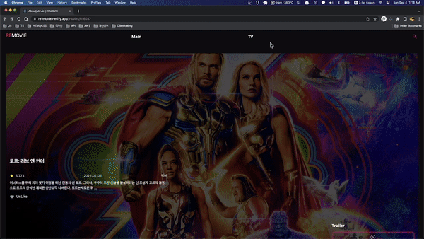

    

    <a display="block" href="https://re-movie.netlify.app/" >
      https://re-movie.netlify.app/
    </a>
    

     

  

## Content

- 🛠 [Built with](#built-with)
- 🚀 [Project](#project)
- 📖 [Pages](#pages)
- ✓ [Features](#features)
- 🔥 [Code](#code)
- 👍 [느낀점](#느낀점)

---

## Built with

### Front-end

- `React`
- `Typescript`
- `Styled-components`
- `Framer-motion`
- `React-hook-form`
- `Apollo-client`

### Back-end

- `Apollo-server`
- `Express`
- `Graphql`

### Deploy

- `Netlify`
- `Heroku`

---

## Project

→ 영화 또는 TV프로그램을 카테고리별로 소개하는 사이트

> 영화(Main page)

- 현재 인기있는 영화와 상영 예정인 영화들을 확인할 수 있습니다.
- 영화 포스터와 영화 제목을 확인할 수 있으며, 클릭하면 영화 상세정보 페이지로 이동합니다.

  

> 영화 상세정보

- 영화제목과, 평점, 날짜 , 장르, 설명 등 영화 정보를 확인 할 수 있습니다.
- 영화 트레일러를 확인할 수 있습니다.
- `Apollo client`의 캐시를 직접 조작하여 즉각적인 UI 반응을 확인할 수 있습니다.  
  → "Like - UnLike"
- 영화 배우를 확인할 수 있고 클릭시 영화배우들의 정보를 확인할 수 있습니다.
- 추천영화들을 확인해 볼 수 있습니다.

  

> TV

- 현재 인기 있는 TV프로그램과 방영 예정인 TV프로그램을 확인할 수 있습니다.
- TV프로그램의 포스터와 제목을 확인할 수 있으며, 클릭하면 TV프로그램의 상세정보를 확인할 수 있습니다.

  

> TV 상세정보

- TV프로그램 제목, 평점, 날짜, 장르, 설명 등 정보를 확인할 수 있습니다.
- 트레일러를 확인할 수 있습니다.
- `Apollo client`의 캐시를 직접 조작하여 즉각적인 UI 반응을 확인할 수 있습니다.  
   → "Like - UnLike"
- TV프로그램 출연 배우를 확인할 수 있고 클릭시 배우들의 정보를 확인할 수 있습니다.
- 추천 TV프로그램들을 확인해 볼 수 있습니다.

  

> TV 프로그램, 영화 검색

- 검색 페이지에서 영화 또는 TV프로그램들을 검색할 수 있습니다.
- 영화 또는 TV프로그램의 제목을 입력하여 검색시, 해당 제목이 포함된 전체 영화와 TV프로그램을 찾을 수 있습니다.

  

  

---

## Pages

## Navigation

- 메인
- 영화
- TV 프로그램
- 검색

## 영화

- 인기 영화
- 상영 예정
- 상세정보
- 추천 영화

## TV 프로그램

- 인기 TV 프로그램
- 상영 예정
- 상세정보
- 추천 TV 프로그램

---

## Features

### 🎬

- 인기 영화, 상영 영화 보기
- 상세정보 확인하기
- 트레일러 보기
- "좋아요" 클릭하기
- 추천 영화 보기

### 📺

- 인기 TV 프로그램, 상영 TV 프로그램 보기
- 상세정보 확인하기
- 트레일러 보기
- "좋아요" 클릭하기
- 추천 TV 프로그램 보기

---

## Code

<a href="https://github.com/jangth0655/ReMovie-client">🔥 GitHub</a>

  

## 느낀점

- 자주 접할 수 있는 REST API보다 Graphql을 통해 서버와 데이터를 주고 받아 흥미로웠다.
- `Apollo client`의 `useQuery` 사용하여 데이터를 쿼리하였고,
- `useMutation`을 사용하여 캐시를 조작하여 "좋아요"를 구현해보았다.
- 캐시 조작시 직접 `fragment`를 조작하기 위해 `writeFragment`를 사용하였고
- `fragment`를 좀 더 이해할 수 있는 계기가 되었다.
- `styled-components`와 `framer-motion`을 리액트와 함께 활용하면서 UI개발을 보다 쉽게할 수 있었다.
